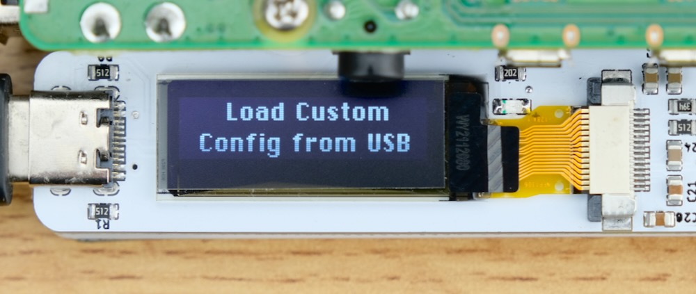

# USB4VC Configurator

[Get USB4VC](https://github.com/dekuNukem/USB4VC/blob/master/README.md) | [Official Discord](https://discord.gg/HAuuh3pAmB) | [Getting Started](https://github.com/dekuNukem/USB4VC/blob/master/getting_started.md)

With USB4VC Configurator, you can **update USB4VC software** and **add custom gamepad mappings**. This guide shows you how.

## Prepare USB Flashdrive

USB4VC Configurator will save all the updates and configuration files into a USB flash drive, so you'll need one of those.

Make sure it is formatted in FAT32:

## Download and Launch the App

[Head here](https://github.com/dekuNukem/usb4vc-configurator/releases/latest) to download the latest release.

Extract the `.zip` file and launch the app by clicking `usb4vc_config.exe`:

## "Untrusted App" Warnings

When trying to run the app, your system might complain about this software being untrusted. This is because I haven't had the code digitally signed, which costs hundreds of dollars a year.

Feel free to [review the code](https://github.com/dekuNukem/usb4vc-configurator/tree/master/src), you can also run `usb4vc_config.py` directly with Python3. 

For Windows 10, click `More info` and then `Run anyway`.

For macOS, **`RIGHT CLICK`** on the app and select `Open`. You might have to do it twice.

## Using the App

### Select flash drive

Press the `Open...` button and select **the entire flash drive**:

### Copy updates

If you want to update USB4VC to latest software, press `Copy Latest USB4VC Updates to Flash Drive` button.

If there are updates for the configurator itself, it will let you know too.

### Make a profile

You can create multiple *profiles* for your USB gamepad. Each profile contains a different mapping.

Typically you make one for each game / OS.

Click `New` to create a new profile, enter a name, and select the desired protocol card and USB gamepad type.

### Create a new mapping

Click `New` in `Mappings` section to create a new mapping.

Select the desired combination, and press `Save this Mapping`.

Currently the following combinations are allowed:

USB gamepad **BUTTONS** can be mapped to:

* Keyboard Keys
* Mouse Buttons
* 15-Pin Gamepad Buttons
* 15-Pin Gamepad Half Axes

USB gamepad **AXES** can be mapped to:

* Keyboard Keys
* Mouse Axes
* 15-Pin Gamepad Axes
* 15-Pin Gamepad Half Axes (Xbox analog triggers only)

When mapping **USB gamepad axes to keyboard keys**, make sure to select TWO keys for both direction.

When mapping **analog triggers** to keyboard keys, select the same key.

After creating your mappings, press `Write Current Mappings to Flash Drive` button:

Eject the flash drive, and plug it in the USB4VC.

## Apply Updates on USB4VC

Select "Update via USB Flashdrive" in the main menu. It will:

* Copy over latest software updates

* Back up settings and debug logs to flash drive

* Update Protocol Card firmware if needed

* Relaunch the application

The new profiles should appear in the `Gamepad Protocol` setting, use `enter` button to cycle through.

That's pretty much it! Hopefully it works!

## Questions or Comments?

Feel free to ask in official [Discord Chatroom](https://discord.gg/HAuuh3pAmB), raise a [Github issue](https://github.com/dekuNukem/usb4vc-configurator/issues), [DM on Twitter](https://twitter.com/dekuNukem_), or email `dekunukem` `gmail.com`!
